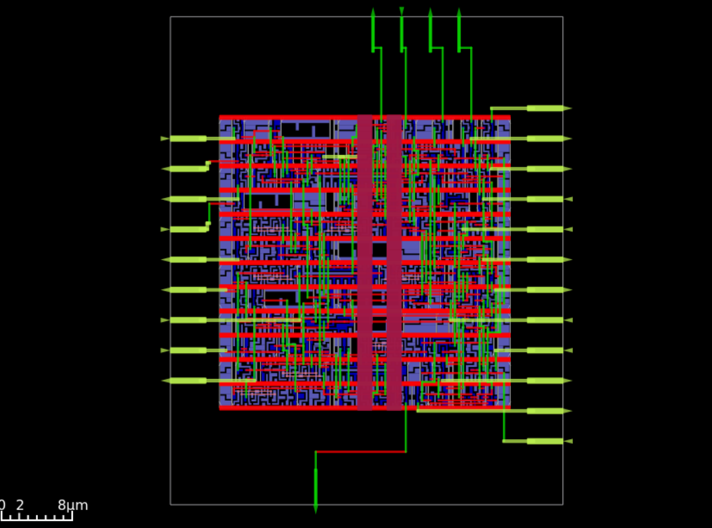

# 4-bit CPU ASIC Layout (Sky130 + OpenLane)

This project implements a small 4-bit CPU datapath, written in Verilog, synthesized and placed/routed using [OpenLane v2.3.10](https://github.com/The-OpenROAD-Project/OpenLane) targeting the Sky130 standard cell library.

---

## 📦 Overview

The CPU datapath includes:
- A 4-bit ALU (with add, AND, OR, XOR operations)
- A load-enabled register
- A 3-bit program counter
- Instruction ROM
- Top-level integration of all modules

The design was synthesized and laid out for ASIC fabrication using Skywater’s Sky130A PDK.

---

## 🧠 Design Details

- **Top module:** `cpu`
- **Clock port:** `clk`
- **Clock period constraint:** `50 ns`
- **Tech node:** Sky130 (130nm)
- **Toolflow:** OpenLane v2.3.10 (Nix install)
- **PDK manager:** Volare

All Verilog modules use strict ASIC-safe style: 
- No latches
- Fully synchronous logic
- `default_nettype none`
- Explicit wire/reg declarations
- `timescale 1ns/1ps`

---

## ⏱️ Timing Summary

| Parameter              | Value              |
|------------------------|--------------------|
| Clock Period           | 50 ns              |
| Worst-case Path Delay  | ~29 ns             |
| Timing Slack           | ~+21 ns            |
| Setup Violations       | 0                  |
| Hold Violations        | 0                  |
| Corners Verified       | `tt`, `ss`, `ff`, `min`, `max` corners |

✔️ All timing constraints met with significant margin.

---

## 📏 Layout and Area

| Metric                      | Value              |
|-----------------------------|--------------------|
| Die Area                    | 2418.55 µm²        |
| Core Area                   | 1066.02 µm²        |
| Standard Cells Used         | 109                |
| Core Utilization            | ~71%               |
| IO Pins                     | 28                 |
| Routing DRC Errors          | 0                  |
| LVS Errors                  | 0                  |
| Antenna Violations          | 0                  |

---

## ⚡ Power Estimates

| Component         | Power (W)             |
|-------------------|------------------------|
| Internal Switching| 27.3 nW               |
| Net Switching     | 16.3 nW               |
| Leakage           | 1.03 nW               |
| **Total**         | **43.6 nW**           |

---

## 📸 GDSII Layout

- Red = power/ground rails
- Green = I/O ports and routing
- Blue/Purple = standard cell placement

Visualized using [KLayout](https://www.klayout.de/).
